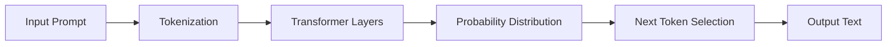

# Basics of LLMs

> An LLM is not a brain; it is an incredibly powerful token calculator. Treat it accordingly.

---

## What it is

A Large Language Model (LLM) is a neural network trained on vast amounts of text data to predict the next word (or "token") in a sequence. When you give it a prompt, it calculates the highest-probability continuation based on the patterns it learned during training.

It does not "think" or "know" facts in a human sense. It maps statistical relationships between concepts. Understanding this probabilistic nature is essential for building robust agents, as it explains why models can hallucinate, get confused by poor formatting, or require specific phrasing to perform well.



---

## Why it matters in production

If you assume an LLM is a reasoning engine with perfect recall, you will design fragile systems. Because they are probabilistic, LLMs will confidently invent APIs, hallucinate facts, or drift away from instructions if the context window gets too noisy.

In production, you cannot rely on an LLM to self-correct without explicit instruction. You must design fallback mechanisms, retry loops, and validation steps. A raw LLM is a vulnerability; an LLM governed by a strict state machine is a tool.

---

## How Agenthood implements it

Agenthood abstracts the complexities of LLMs behind the `ILLMProvider` interface, allowing you to swap between the 4 major providers (Anthropic, OpenAI, Google, and local models) without rewriting your agent logic.

This is planned for a future milestone and will live in `src/llm/ILLMProvider.ts`:

```typescript
// Planned for a future milestone
export interface ILLMProvider {
  /**
   * Generates a completion using the specified provider.
   */
  complete(request: LLMRequest): Promise<LLMResponse>;
}
```

By forcing all LLMs through a unified interface, Agenthood ensures that provider-specific quirks do not pollute the core logic of the Society's members.

---

## Hands-on example

To see how the Society interacts with LLMs under the hood, you can inspect the configuration of an existing member:

```bash
# Check the active members and their current configuration
npx agenthood check
```

Or in TypeScript (future milestone):

```typescript
import { AnthropicProvider } from '@agenthood/llm';

const provider = new AnthropicProvider({ apiKey: process.env.ANTHROPIC_API_KEY });
const response = await provider.complete({ prompt: 'Explain the Society.' });
```

---

## Further reading

- [ADR-005 — Orchestrator pattern](../../docs/adr/ADR-005-orchestrator-pattern.md)
- [`src/llm/ILLMProvider.ts`](../../src/llm/ILLMProvider.ts) — source implementation (planned)
- [Anthropic: Introduction to Prompting](https://docs.anthropic.com/en/docs/intro-to-prompting) — excellent foundational knowledge

---

## LinkedIn version

**Hook:** An LLM is not a brain; it is an incredibly powerful token calculator. Treat it accordingly.

**Why it matters:**
- LLMs are probabilistic token predictors, not logic engines
- Without guardrails, they will confidently hallucinate APIs and facts
- Provider abstraction lets you swap models when one inevitably degrades

**→** [Read the full article + implementation walkthrough →](https://fworks-tech.github.io/agenthood/academy/level-1-genai-rag-basics/02-basics-of-llms/)
