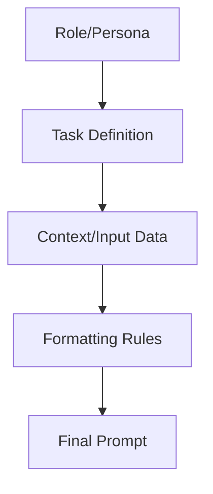

# Prompt Engineering

> A poor prompt is a failure of leadership. The Society demands clarity.

---

## What it is

Prompt engineering is the discipline of structuring text so an LLM understands exactly what you want, how to format it, and what constraints to follow. It is the UI of the generative AI world.

Effective prompting relies on clear context, specific instructions, and formatted output schemas (like JSON or XML). It is not about "tricking" the model; it is about providing the precise statistical context the model needs to navigate its latent space toward the correct answer.



---

## Why it matters in production

If your prompts are vague, the LLM will guess your intent. In a chat interface, a bad guess is annoying. In an autonomous agent, a bad guess means the agent deletes the wrong file, misinterprets code, or enters an infinite loop.

Production prompt engineering prevents context degradation. It ensures the model's output can be safely parsed by downstream code, dramatically reducing `JSON.parse` errors and unpredictable state transitions.

---

## How Agenthood implements it

Agenthood implements prompt engineering through the `PromptBuilder` utility and the strict Markdown templates defining its members (`members/*/*.md`). 

The `PromptBuilder` (planned for a future milestone in `src/llm/PromptBuilder.ts`) constructs structured prompts programmatically:

```typescript
// Planned for a future milestone
const prompt = new PromptBuilder()
  .setSystem(member.systemPrompt)
  .addContext(codeDiff)
  .setInstruction('Review this diff for security flaws.')
  .requireFormat('json')
  .build();
```

Instead of chaotic string concatenation, Agenthood uses typed builders and rigid templates to guarantee prompt integrity.

---

## Hands-on example

You can view the Society's mastery of prompt engineering by reading any of the member files.

```bash
# Read The Reviewer's strict prompt instructions
cat members/the-reviewer/the-reviewer.md
```

Or programmatically (future milestone):

```typescript
import { PromptBuilder } from '@agenthood/llm';

const p = new PromptBuilder().setInstruction('Do not hallucinate.').build();
```

---

## Further reading

- [ADR-001 — Markdown skills over code agents](../../docs/adr/ADR-001-markdown-skills-over-code-agents.md)
- [`src/llm/PromptBuilder.ts`](../../src/llm/PromptBuilder.ts) — source implementation (planned)
- [OpenAI: Prompt Engineering Guide](https://platform.openai.com/docs/guides/prompt-engineering) — best practices for structuring prompts

---

## LinkedIn version

**Hook:** A poor prompt is a failure of leadership. The Society demands clarity.

**Why it matters:**
- Vague prompts force LLMs to guess, and LLM guesses break production
- Well-engineered prompts ensure parseable, deterministic outputs
- Building prompts programmatically prevents context degradation

**→** [Read the full article + implementation walkthrough →](https://fworks-tech.github.io/agenthood/academy/level-1-genai-rag-basics/03-prompt-engineering/)
