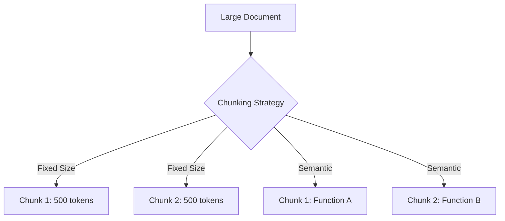

# Chunking Strategies

> Poor chunking quietly destroys retrieval quality. The Society does not tolerate quiet destruction.

---

## What it is

Chunking is the process of breaking a large document into smaller, manageable pieces before embedding and storing them in a vector database. Because LLMs have context window limits and embedding models have maximum token constraints, you cannot process a 1,000-page manual all at once.

A chunking strategy determines *how* to break the text. You can split by character count, by word, by paragraph, or by semantic structure (like Markdown headers or code functions). 



---

## Why it matters in production

If you blindly chop text every 500 characters, you will split sentences in half and sever code blocks from their declarations. When the retriever fetches that chunk later, the LLM will lack the necessary context to answer the user's question, leading to hallucinations.

In production, bad chunking is the number one cause of RAG failure. A smart `HierarchicalChunkStrategy` ensures that the semantic meaning of the text is preserved, drastically improving the accuracy of vector search.

---

## How Agenthood implements it

Agenthood plans to implement chunking via the `ChunkStrategy` interface, specifically utilizing a `HierarchicalChunkStrategy` for code and markdown parsing.

This will be found in `src/rag/ChunkStrategy.ts` (future milestone):

```typescript
// Planned for a future milestone
export interface ChunkStrategy {
  chunk(text: string, metadata: FileMetadata): DocumentChunk[];
}

export class HierarchicalChunkStrategy implements ChunkStrategy {
  // Splits Markdown by H1, H2, H3 or Code by class/function
}
```

The Society understands that code cannot be split arbitrarily. A function must remain whole.

---

## Hands-on example

Though the formal pipeline is under development, you can test semantic chunking concepts using standard text processing:

```bash
# A future command to test chunking
npx agenthood rag:chunk README.md --strategy semantic
```

Or conceptually in TypeScript:

```typescript
// Example of a naive vs semantic split
const text = "export class Agent { ... }";
// Bad: text.slice(0, 10) -> "export cla"
// Good: extract syntax tree node
```

---

## Further reading

- [ADR-010 — LanceDB for Vector Storage](../../adr/ADR-010-lancedb-for-vector-storage.md)
- [`src/rag/ChunkStrategy.ts`](../../src/rag/ChunkStrategy.ts) — source implementation (planned)
- [Pinecone: Chunking Strategies](https://www.pinecone.io/learn/chunking-strategies/) — an excellent breakdown of chunking methods

---

## LinkedIn version

**Hook:** Poor chunking quietly destroys retrieval quality. The Society does not tolerate quiet destruction.

**Why it matters:**
- Blindly chopping text destroys context
- Splitting a code block in half makes it unreadable for the LLM
- Semantic chunking preserves meaning and rescues RAG pipelines

**→** [Read the full article + implementation walkthrough →](https://agenthood.flabs.tech/academy/level-1-genai-rag-basics/05-chunking-strategies/)
