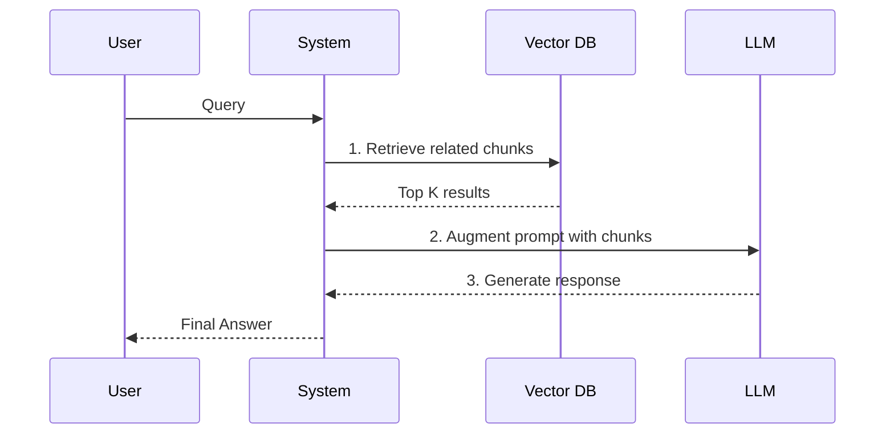

# RAG Fundamentals

> An agent without a retrieval pipeline is just a confidently loud amnesiac. 

---

## What it is

Retrieval-Augmented Generation (RAG) is a pattern that gives an LLM access to external knowledge it was not trained on. Instead of relying purely on its internal weights, the system:

1. **Retrieves** relevant information from a database based on the user's query.
2. **Augments** the prompt by injecting that retrieved information into the context window.
3. **Generates** the final answer using the newly provided facts.



---

## Why it matters in production

LLMs have a static knowledge cutoff and cannot access your private codebase, Slack messages, or documentation. If you ask an agent to "debug the billing service," it will hallucinate unless it can read the billing service code.

RAG grounds the LLM in reality. In production, RAG prevents hallucinations, allows for citation of sources, and enables agents to act on proprietary data without requiring expensive model fine-tuning.

---

## How Agenthood implements it

Agenthood's RAG architecture starts with `KnowledgeGraphStore` for structural retrieval. The `Retriever` and `Indexer` components are implemented at `src/rag/` (shipped in Phase 1):

```typescript
export class Retriever {
  constructor(private vectorStore: VectorStore, private embedder: Embedder) {}

  async retrieveContext(query: string): Promise<DocumentChunk[]> {
    const vector = await this.embedder.embed(query);
    return this.vectorStore.search(vector, { topK: 5 });
  }
}
```

The Society retrieves facts before it speaks.

---

## Hands-on example

The structural retrieval layer (`KnowledgeGraphStore`) is available now. The full indexing and embedding pipeline is planned for a subsequent milestone, at which point you will be able to:

```bash
# Index the current repository (future milestone)
# No dedicated CLI subcommand — use the API directly (see src/rag/Indexer.ts)

# Query the codebase (future milestone)
# No dedicated CLI subcommand — use the API directly (see src/rag/Retriever.ts)
```

---

## Further reading

- [ADR-010 — LanceDB for Vector Storage](../../adr/ADR-010-lancedb-for-vector-storage.md)
- [`src/rag/KnowledgeGraphStore.ts`](../../../src/rag/KnowledgeGraphStore.ts) — bidirectional graph store (shipped)
- [`src/memory/VectorStore.ts`](../../../src/memory/VectorStore.ts) — LanceDB vector store (shipped)
- [IBM: What is RAG?](https://research.ibm.com/blog/retrieval-augmented-generation-RAG) — foundational overview of the RAG pattern


