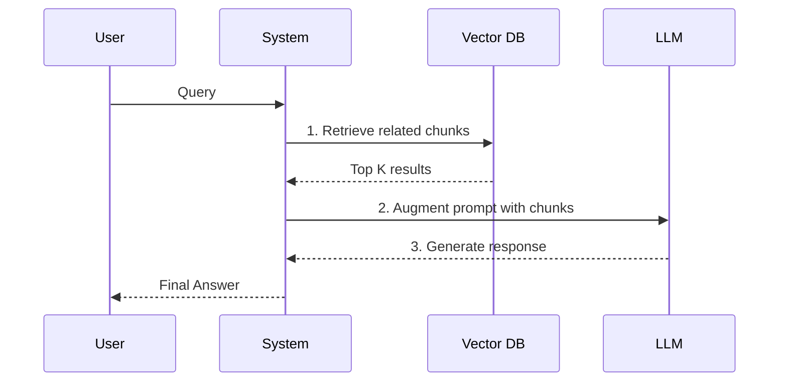

# RAG Fundamentals

> An agent without a retrieval pipeline is just a confidently loud amnesiac. 

---

## What it is

Retrieval-Augmented Generation (RAG) is a pattern that gives an LLM access to external knowledge it was not trained on. Instead of relying purely on its internal weights, the system:

1. **Retrieves** relevant information from a database based on the user's query.
2. **Augments** the prompt by injecting that retrieved information into the context window.
3. **Generates** the final answer using the newly provided facts.



---

## Why it matters in production

LLMs have a static knowledge cutoff and cannot access your private codebase, Slack messages, or documentation. If you ask an agent to "debug the billing service," it will hallucinate unless it can read the billing service code.

RAG grounds the LLM in reality. In production, RAG prevents hallucinations, allows for citation of sources, and enables agents to act on proprietary data without requiring expensive model fine-tuning.

---

## How Agenthood implements it

Agenthood's planned RAG architecture is built around three core components: the `Indexer` (for ingesting files), the `Embedder` (for vectorizing them), and the `Retriever` (for fetching context).

These components will reside in `src/rag/Retriever.ts` and `src/rag/Indexer.ts` (future milestone):

```typescript
// Planned for a future milestone
export class Retriever {
  constructor(private vectorStore: VectorStore, private embedder: Embedder) {}

  async retrieveContext(query: string): Promise<DocumentChunk[]> {
    const vector = await this.embedder.embed(query);
    return this.vectorStore.search(vector, { topK: 5 });
  }
}
```

The Society retrieves facts before it speaks.

---

## Hands-on example

Once the RAG module is fully implemented in a future milestone, you will be able to index and query your repository directly:

```bash
# Index the current repository
agenthood run rag:index .

# Query the codebase
agenthood run rag:query "Where is the orchestrator defined?"
```

Or in TypeScript (future milestone):

```typescript
const context = await retriever.retrieveContext("Explain the orchestrator");
const prompt = `Use this context: ${context}

Explain the orchestrator.`;
```

---

## Further reading

- [ADR-010 — RAG Architecture (Planned)](../../docs/adr/ADR-010-rag-architecture.md)
- [`src/rag/Retriever.ts`](../../src/rag/Retriever.ts) — source implementation (planned)
- [IBM: What is RAG?](https://research.ibm.com/blog/retrieval-augmented-generation-RAG) — foundational overview of the RAG pattern

---

## LinkedIn version

**Hook:** An agent without a retrieval pipeline is just a confidently loud amnesiac.

**Why it matters:**
- LLMs don't know your private codebase or company docs
- Fine-tuning is expensive and slow; RAG is fast and factual
- RAG grounds the LLM in reality and forces it to cite its sources

**→** [Read the full article + implementation walkthrough →](https://fworks-tech.github.io/agenthood/academy/level-1-genai-rag-basics/06-rag-fundamentals/)
