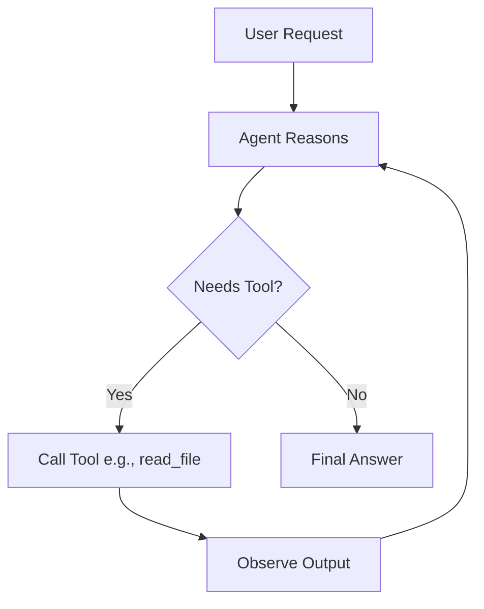

# Tool Integration

> Agents that cannot plan cannot be trusted. Agents that cannot act are just chatbots. Planning and acting requires tools.

---

## What it is

Tool Integration (also known as Function Calling) is the mechanism that allows an LLM to interact with the outside world. Instead of just returning text, the model can return a structured request to execute a specific function—such as reading a file, querying a database, or triggering a CI pipeline.

This is powered by the ReAct (Reasoning and Acting) loop: the agent observes its environment, reasons about what to do next, executes a tool, observes the result, and loops until the goal is achieved.



---

## Why it matters in production

Without tools, an LLM is isolated in a sandbox. It cannot verify if code compiles, it cannot read a Slack message, and it cannot commit to a repository. 

In production, agents must take action. But blindly allowing an LLM to execute code is a massive security risk. Tools provide the strict, typed boundary where the LLM's requested actions are validated, scoped, and executed safely by your application logic.

---

## How Agenthood implements it

Agenthood implements this via the `ISkill` interface, managed by the `SkillRegistry`, and executed within a `ReActLoop`.

This allows members of the Society to seamlessly utilize tools. The architecture will reside in `src/agent/ISkill.ts` (future milestone):

```typescript
// Planned for a future milestone
export interface ISkill {
  name: string;
  description: string;
  schema: JSONSchema;
  execute(args: any): Promise<string>;
}

export class SkillRegistry {
  register(skill: ISkill): void;
  getAvailableTools(): ToolDefinition[];
}
```

The Society demands that all actions are defined by a strict `JSONSchema` contract.

---

## Hands-on example

When the runtime is active, you can provide tools directly to an agent:

```bash
# Invoke an agent and provide it with filesystem skills
agenthood-run invoke the-architect "Draft an ADR" --tools fs-write,fs-read
```

Or in TypeScript (future milestone):

```typescript
const registry = new SkillRegistry();
registry.register(new FileReadSkill());

const loop = new ReActLoop(provider, registry);
await loop.run("Read the package.json and summarize dependencies.");
```

---

## Further reading

- [ADR-006 — Python runtime as additive layer](../../docs/adr/ADR-006-python-runtime-as-additive-layer.md)
- [`src/agent/ISkill.ts`](../../src/agent/ISkill.ts) — source implementation (planned)
- [ReAct: Synergizing Reasoning and Acting in Language Models](https://arxiv.org/abs/2210.03629) — the foundational paper on tool use

---

## LinkedIn version

**Hook:** Agents that cannot act are just chatbots. Planning and acting requires tools.

**Why it matters:**
- Without tools, LLMs are isolated in a sandbox
- Function calling lets agents read files, hit APIs, and trigger CI pipelines
- Tool registries provide a secure boundary between LLM reasoning and system execution

**→** [Read the full article + implementation walkthrough →](https://agenthood.flabs.tech/academy/level-1-genai-rag-basics/09-tool-integration/)
